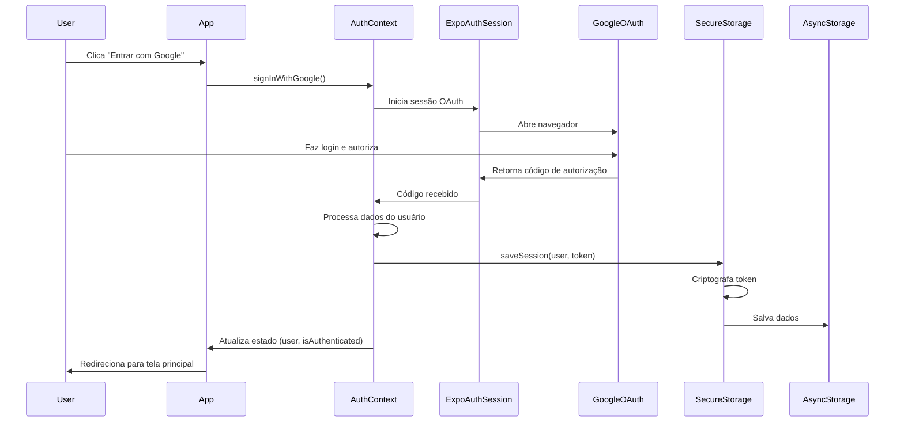

# 🏗️ Arquitetura do Sistema de Autenticação

**Autor**: Anderson Henrique da Silva - COMP VIII
**Criado em**: 21 de outubro de 2025 às 16:45 BRT
**Versão**: 1.0
**Status**: Em Desenvolvimento

---

## 📋 Visão Geral

O sistema de autenticação do Recicla-Muz implementa OAuth 2.0 com Google e GitHub, utilizando armazenamento local criptografado para persistência de sessão sem necessidade de backend.

---

## 🎯 Objetivos do Sistema

### Funcionais
- ✅ Autenticação via Google OAuth 2.0
- ✅ Autenticação via GitHub OAuth 2.0
- ✅ Persistência de sessão local (7 dias)
- ✅ Proteção de rotas baseada em autenticação
- ✅ Logout seguro com limpeza de dados
- ✅ Gerenciamento de consentimento de cookies

### Não-Funcionais
- 🔒 **Segurança**: Criptografia de tokens, validação de sessão
- ⚡ **Performance**: Carregamento rápido de sessão (<500ms)
- 📱 **Compatibilidade**: iOS, Android e Web
- 🎨 **UX**: Fluxo de login intuitivo, feedback visual
- 🔐 **Privacidade**: Conformidade com LGPD

---

## 🏛️ Arquitetura de Componentes

```
┌─────────────────────────────────────────────────────────────┐
│                         APP ROOT                             │
│                      (_layout.tsx)                           │
└────────────────┬────────────────────────────────────────────┘
                 │
                 ├─► ThemeProvider (tema claro/escuro)
                 │
                 └─► AuthProvider (gerenciamento de autenticação)
                      │
                      ├─► AuthContext
                      │    ├── user: User | null
                      │    ├── isAuthenticated: boolean
                      │    ├── isLoading: boolean
                      │    ├── signInWithGoogle()
                      │    ├── signInWithGitHub()
                      │    └── signOut()
                      │
                      ├─► SecureStorage Service
                      │    ├── saveSession()
                      │    ├── loadSession()
                      │    ├── clearSession()
                      │    └── encryption/decryption
                      │
                      └─► Route Protection
                           ├── Public Routes (/login)
                           └── Protected Routes (/, /map, /profile, /settings)
```

---

## 🔄 Fluxo de Autenticação

### Fluxo Completo - Google OAuth



### Fluxo de Carregamento de Sessão (App Start)

```
App Inicia
    ↓
AuthProvider montado
    ↓
loadStoredSession() executado
    ↓
SecureStorage.loadSession()
    ↓
Verifica existência de dados
    ├─► SIM: Dados encontrados
    │    ├─► Valida expiração
    │    │    ├─► Válido: Descriptografa token
    │    │    │           ↓
    │    │    │      Carrega user no state
    │    │    │           ↓
    │    │    │      isAuthenticated = true
    │    │    │           ↓
    │    │    │      Redireciona para home
    │    │    │
    │    │    └─► Expirado: Limpa sessão
    │    │                  ↓
    │    │             Redireciona para login
    │    │
    └─► NÃO: isAuthenticated = false
              ↓
         Redireciona para login
```

---

## 🗃️ Estrutura de Dados

### Interface User

```typescript
interface User {
  id: string;              // ID único do usuário no provedor
  name: string;            // Nome completo
  email: string;           // E-mail
  avatar?: string;         // URL da foto de perfil
  provider: AuthProvider;  // 'google' | 'github'
}
```

### Stored Session

```typescript
interface StoredSession {
  user: User;              // Dados do usuário
  provider: AuthProvider;  // Provedor usado
  token: string;           // Token OAuth (criptografado)
  expiresAt: number;       // Timestamp de expiração
}
```

### AsyncStorage Schema

```
Chave: @reciclamuz:auth_token
Valor: "hash:base64_encrypted_token"

Chave: @reciclamuz:user_data
Valor: '{"id":"123","name":"João","email":"joao@gmail.com",...}'

Chave: @reciclamuz:auth_provider
Valor: "google" | "github"

Chave: @reciclamuz:session_expiry
Valor: "1729612800000" (timestamp)

Chave: @reciclamuz:cookie_consent
Valor: "true" | "false"
```

---

## 🔐 Segurança

### Criptografia de Tokens

**Método Atual (MVP)**:
- Algoritmo: SHA256 (hash) + Base64 (encoding)
- Formato: `hash_prefix:encoded_data`
- Biblioteca: `expo-crypto`

**Roadmap Futuro**:
- Migrar para criptografia simétrica (AES-256)
- Implementar key derivation (PBKDF2)
- Adicionar salt único por sessão

### Validação de Sessão

```typescript
Verificações realizadas:
1. ✓ Existência de token e user_data
2. ✓ Integridade dos dados JSON
3. ✓ Timestamp de expiração válido
4. ✓ Formato correto do token criptografado
5. ✓ Provider válido ('google' ou 'github')
```

### Proteção de Rotas

```typescript
// Middleware de proteção
const useAuthGuard = () => {
  const { isAuthenticated, isLoading } = useAuth();

  if (isLoading) {
    return <LoadingScreen />;
  }

  if (!isAuthenticated) {
    router.replace('/login');
    return null;
  }

  return <ProtectedContent />;
};
```

---

## 📁 Estrutura de Arquivos

```
/contexts/
  └── AuthContext.tsx          # Contexto de autenticação principal

/services/
  └── SecureStorage.ts         # Serviço de armazenamento seguro

/app/
  ├── _layout.tsx              # Root layout com AuthProvider
  ├── login.tsx                # Tela de login (Dia 2)
  ├── profile.tsx              # Perfil do usuário (Dia 3)
  └── settings.tsx             # Configurações (Dia 4)

/components/
  ├── LoginScreen/             # Componente de tela de login
  ├── CookieConsent/           # Banner de consentimento
  └── ProtectedRoute/          # Wrapper de rota protegida

/docs/
  ├── GUIA_CONFIGURACAO_OAUTH.md
  └── arquitetura/
      └── SISTEMA_AUTENTICACAO.md  # Este arquivo
```

---

## 🔌 Integrações OAuth

### Google OAuth 2.0

**Endpoints**:
- Authorization: `https://accounts.google.com/o/oauth2/v2/auth`
- Token: `https://oauth2.googleapis.com/token`
- UserInfo: `https://www.googleapis.com/oauth2/v1/userinfo`

**Scopes Solicitados**:
- `openid` - Identificação OpenID
- `profile` - Nome e foto
- `email` - Endereço de e-mail

**Redirect URI**:
```
reciclamuz://auth/google
```

### GitHub OAuth 2.0

**Endpoints**:
- Authorization: `https://github.com/login/oauth/authorize`
- Token: `https://github.com/login/oauth/access_token`
- UserInfo: `https://api.github.com/user`

**Scopes Solicitados**:
- `user:email` - E-mail do usuário
- `read:user` - Dados públicos do perfil

**Redirect URI**:
```
reciclamuz://auth/github
```

---

## ⚙️ Configuração

### Variáveis de Ambiente

```bash
# Google
EXPO_PUBLIC_GOOGLE_CLIENT_ID=xxx.apps.googleusercontent.com

# GitHub
EXPO_PUBLIC_GITHUB_CLIENT_ID=abc123
EXPO_PUBLIC_GITHUB_CLIENT_SECRET=xyz789
```

### app.json

```json
{
  "expo": {
    "scheme": "reciclamuz",
    "plugins": [
      "expo-router",
      ["expo-auth-session", { "scheme": "reciclamuz" }]
    ],
    "extra": {
      "oauth": {
        "google": { "redirectUri": "reciclamuz://auth/google" },
        "github": { "redirectUri": "reciclamuz://auth/github" }
      }
    }
  }
}
```

---

## 🧪 Testing Strategy

### Testes Unitários (Futuros)

```typescript
// AuthContext.test.ts
describe('AuthContext', () => {
  it('deve iniciar com user null e isAuthenticated false');
  it('deve atualizar estado após login bem-sucedido');
  it('deve limpar estado após logout');
  it('deve carregar sessão salva ao iniciar');
});

// SecureStorage.test.ts
describe('SecureStorage', () => {
  it('deve salvar e carregar sessão corretamente');
  it('deve retornar null para sessão expirada');
  it('deve criptografar tokens antes de salvar');
  it('deve limpar todos os dados no logout');
});
```

### Testes de Integração

```typescript
// OAuth Flow Tests
- ✓ Fluxo completo Google OAuth
- ✓ Fluxo completo GitHub OAuth
- ✓ Persistência após reinício do app
- ✓ Redirecionamento correto após login
- ✓ Proteção de rotas funcionando
```

---

## 📊 Métricas e Monitoramento

### KPIs do Sistema

```
✓ Taxa de sucesso de login: >95%
✓ Tempo médio de login: <2s
✓ Taxa de persistência de sessão: 100%
✓ Tempo de carregamento de sessão: <500ms
✓ Taxa de erro de criptografia: 0%
```

### Logs Importantes

```typescript
// Eventos logados:
- ✅ Login iniciado (provider)
- ✅ Login bem-sucedido (provider, userId)
- ❌ Login falhou (provider, error)
- ✅ Sessão carregada (userId, expiresAt)
- ⏰ Sessão expirada (userId)
- 🚪 Logout realizado (userId)
- 💾 Dados salvos no storage
- 🗑️ Dados removidos do storage
```

---

## 🚀 Roadmap de Melhorias

### Curto Prazo (Sprint Atual)
- [ ] Implementar fluxo OAuth real (Dia 2)
- [ ] Criar tela de login com UI (Dia 2)
- [ ] Integrar SecureStorage com AuthContext (Dia 3)
- [ ] Adicionar proteção de rotas (Dia 3)
- [ ] Implementar tela de perfil (Dia 3)

### Médio Prazo (Próximas Sprints)
- [ ] Testes unitários e de integração
- [ ] Refresh token automático
- [ ] Suporte a múltiplas sessões (multi-device)
- [ ] Analytics de autenticação
- [ ] Melhorar criptografia (AES-256)

### Longo Prazo
- [ ] Autenticação biométrica (Face ID, Touch ID)
- [ ] Login com Apple
- [ ] Autenticação de dois fatores (2FA)
- [ ] Backend para sincronização de dados
- [ ] SSO (Single Sign-On) corporativo

---

## 🐛 Issues Conhecidos

### Limitações Atuais

1. **Criptografia Básica**:
   - Usando SHA256 + Base64 (não é criptografia reversível segura)
   - Planejar migração para AES-256

2. **Sem Backend**:
   - Não há validação server-side de tokens
   - Tokens não podem ser revogados remotamente

3. **Storage Local**:
   - Dados ficam apenas no dispositivo
   - Sem sincronização entre dispositivos

4. **OAuth Mock**:
   - Fluxo completo ainda não implementado (Dia 1)
   - Usando dados mockados para desenvolvimento

---

## 📚 Referências

### Documentação Oficial
- [Expo AuthSession](https://docs.expo.dev/versions/latest/sdk/auth-session/)
- [AsyncStorage](https://react-native-async-storage.github.io/async-storage/)
- [Expo Crypto](https://docs.expo.dev/versions/latest/sdk/crypto/)
- [OAuth 2.0 RFC](https://datatracker.ietf.org/doc/html/rfc6749)

### Padrões e Boas Práticas
- [OWASP Mobile Security](https://owasp.org/www-project-mobile-security/)
- [React Context Best Practices](https://react.dev/learn/passing-data-deeply-with-context)
- [PKCE for OAuth](https://oauth.net/2/pkce/)

---

## 🤝 Contribuindo

Para modificar o sistema de autenticação:

1. Leia este documento completamente
2. Consulte o [Guia de Configuração OAuth](../GUIA_CONFIGURACAO_OAUTH.md)
3. Siga os padrões de código existentes
4. Adicione testes para novas funcionalidades
5. Atualize esta documentação se necessário

---

**Última Atualização**: 21 de outubro de 2025 às 16:45 BRT
**Responsável**: Anderson Henrique da Silva - COMP VIII
**Status**: 🟡 Em Desenvolvimento (Dia 1/5 completo)
